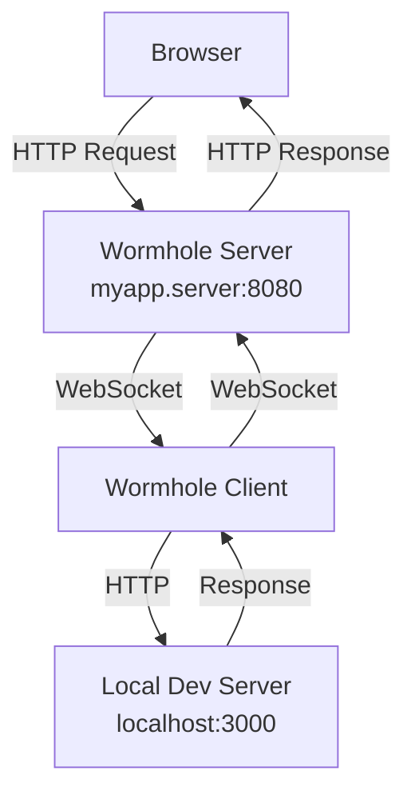

# Wormhole 🕳️

[](https://github.com/dbackowski/wormhole/actions/workflows/test.yml)

A simple HTTP tunneling tool that exposes your local development server to the internet through custom subdomains.

## What it does

Wormhole creates a tunnel between your local development server and the internet, allowing you to:

- Share your local web application with others instantly
- Test webhooks and APIs that require public URLs
- Demo your work-in-progress applications
- Access your local development environment from anywhere

## Quick Start

### 1. Start the server
```bash
go run cmd/server/main.go
```

### 2. Connect your local app
```bash
go run cmd/client/main.go -domain=myapp -local=http://localhost:3000
```

### 3. Access your app
Your local server is now available at: `http://myapp.localhost:8080`

## Installation

### Download Pre-built Binaries

Download the latest release for your platform from the [Releases](https://github.com/dbackowski/wormhole/releases) page.

**Linux:**
```bash
tar -xzf wormhole-client-linux-amd64.tar.gz
chmod +x wormhole
./wormhole -domain=myapp -local=http://localhost:3000
```

**macOS:**

The binaries are not signed with an Apple Developer certificate. After downloading, you need to remove the quarantine attribute:

```bash
tar -xzf wormhole-client-darwin-arm64.tar.gz
xattr -d com.apple.quarantine wormhole
chmod +x wormhole
./wormhole -domain=myapp -local=http://localhost:3000
```

Alternatively, you can right-click the binary in Finder, select "Open", and confirm in the dialog.

### Build from Source

```bash
git clone https://github.com/dbackowski/wormhole.git
cd wormhole
go mod download
make build
```

## Usage

### Server Options
```bash
go run cmd/server/main.go -port=8080
```

**Required flags:**
- `-port`: Port to run the server on (default: 8080)

**Optional flags:**
- `-debug`: Enable debug mode
- `-version`: Print version and exit

### Client Options
```bash
go run cmd/client/main.go -server=http://localhost:8080 -domain=mysubdomain -local=http://localhost:3000
```

**Required flags:**
- `-domain`: Your unique subdomain name
- `-local`: URL of your local development server

**Optional flags:**
- `-server`: Server URL (default: https://wormhole.tools)
- `-webui-port`: Port for the Web UI dashboard (default: 4040)
- `-version`: Print version and exit

## Features

✅ **Custom Subdomains** - Choose your own subdomain name  
✅ **Real-time Tunneling** - Instant request forwarding via WebSockets  
✅ **Header Preservation** - Complete HTTP headers are maintained  
✅ **Multiple Clients** - Support for multiple simultaneous tunnels  
✅ **Automatic Cleanup** - Domains are released when clients disconnect  
✅ **Web UI Dashboard** - Monitor tunneled requests in a browser at `http://localhost:4040`  

## Example Use Cases

- **Frontend Development**: Share your React/Vue/Angular app with team members
- **API Testing**: Test webhook endpoints from external services
- **Mobile Development**: Test your local API with mobile apps
- **Client Demos**: Show work-in-progress to clients without deployment

## Web UI

When the client is running, a dashboard is available at `http://localhost:4040` where you can:

- See the active tunnel URL
- View recent requests with method, path, status code, and timestamp
- Inspect request/response headers and bodies

To use a different port:
```bash
go run cmd/client/main.go -domain=myapp -local=http://localhost:3000 -webui-port=5050
```

## How it works



1. The server listens for client connections and HTTP requests
2. Clients connect via WebSocket and claim a subdomain
3. HTTP requests to `subdomain.server:port` are forwarded to the client over WebSocket
4. The client forwards requests to your local server and returns responses

## Server Endpoints

| Endpoint | Description |
|----------|-------------|
| `/ws` | WebSocket endpoint for client connections |
| `/health` | Health check, returns `OK` |
| `/metrics` | Active connection count |
| `/*` | All other requests are tunneled to the matching subdomain client |

## Self-Hosting

To run your own Wormhole server, you need:

1. **Wildcard DNS** - Point `*.yourdomain.com` to your server so that subdomain-based routing works
2. **TLS termination** - Wormhole does not handle TLS natively. Use a reverse proxy like Caddy or nginx to terminate TLS
3. **Run the server:**
   ```bash
   ./wormhole-server -port=8080
   ```

### Docker

```bash
docker build -t wormhole .
docker run -p 8080:8080 wormhole
```

### Fly.io

The repository includes a `fly.toml` for deployment to Fly.io. Set your `FLY_API_TOKEN` as a GitHub secret for automatic deploys on push to main.

## Limitations

- **No authentication** - Any client can claim any available subdomain
- **No WebSocket passthrough** - WebSocket upgrade requests to tunneled services are not supported
- **No built-in TLS** - Requires a reverse proxy for HTTPS
- **10 MB request body limit** - Requests larger than 10 MB are rejected
- **10 second request timeout** - Requests that take longer than 10 seconds will time out

## Requirements

- Go 1.25 or later
- Available port for the server (default: 8080)
- Local development server to tunnel

## License

Released under the MIT License.

## Contributing

Feel free to open issues and submit pull requests to improve Wormhole!
